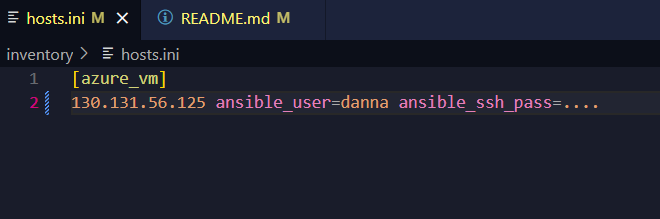
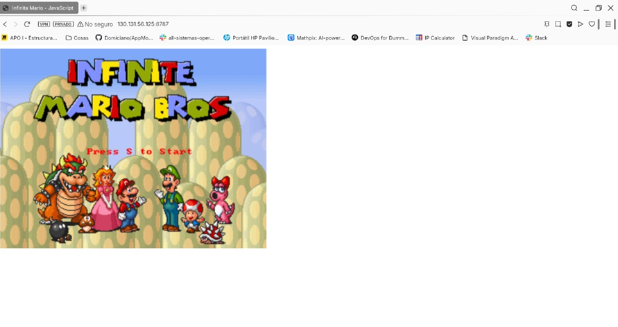

# training-ansible

# Despliegue Automatizado de Super Mario Bros en Azure con Ansible  
**Ingeniería de Software V**  
**Danna Valentina López Muñoz — Código A00395625**

---

## Descripción

En este proyecto se realiza la instalación de Docker y el despliegue de un contenedor con el juego **Super Mario Bros** en una máquina virtual de Microsoft Azure, utilizando **Ansible** como herramienta de gestión de configuración.

El objetivo es demostrar cómo orquestar la instalación de software y la ejecución de servicios en infraestructura remota de manera reproducible y eficiente.

---

## Requisitos

- Ansible instalado en la máquina local (WSL o Ubuntu).
- Acceso SSH a la MV en Azure con Ubuntu.
- Puerto **22** (SSH) abierto en el **NSG** (Network Security Group) de Azure.
- Puerto **8787** abierto en el **NSG** para exponer el juego.

---

## Estructura del Proyecto

training-ansible/
├── inventory/
│ └── hosts.ini
├── playbooks/
│ ├── install_docker.yml
│ └── run_container.yml
└── README.md

## Configuración

En el archivo `inventory/hosts.ini` se cambiaron los datos por los de la MV a la que nos vamos a conectar.


## Instalación de docker

El archivo `playbooks/install_docker.yml` se encarga de instalar las dependencias necesarias, agregar el repositorio oficial de Docker, instalar docker-ce, docker-ce-cli y containerd.io, además inicia el servicio Docker. Para ejecutarlo se emplea el siguiente comando
```bash
ansible-playbook -i inventory/hosts.ini playbooks/install_docker.yml
```


## Ejecución del contenedor

El archivo `playbooks/run_container.yml` se encarga de desplegar el contenedor con la imagen pengbai/docker-supermario:latest y expone el juego en el puerto 8787. Para ejecutarlo se emplea el siguiente comando
```bash
ansible-playbook -i inventory/hosts.ini playbooks/run_container.yml
```

##Acceder al juego

Para accedar al juego se debe agregar el acceso por el puerto 8787 a la máquina virtual desde otras direcciones, para esto, se agrega la regla de seguridad en el grupo de seguridad de la MV


Y una vez que está esto configurado, accedemos desde el navegador a la dirección ip de la máquina hacia el puerto 8787


Como podemos apreciar en la imagen anterior, Docker se instaló en la máquina virtual y el contenedor fue desplegado exitosamente, y se encuentra disponible a través de la dirección pública de la MV en el puerto configurado.